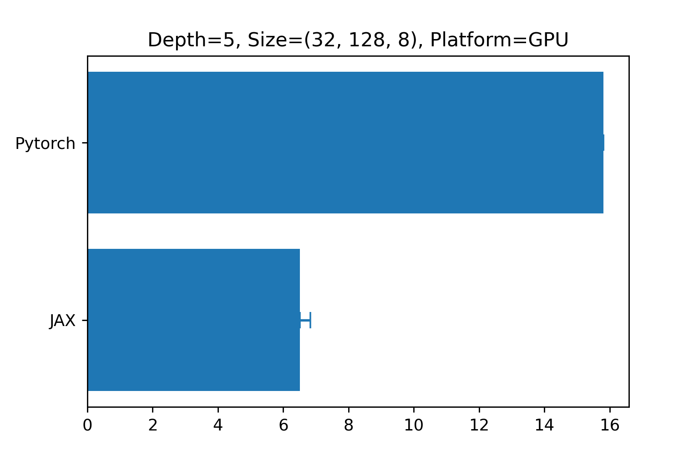
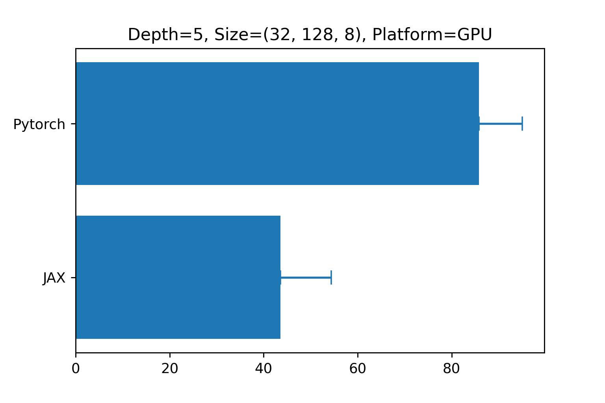
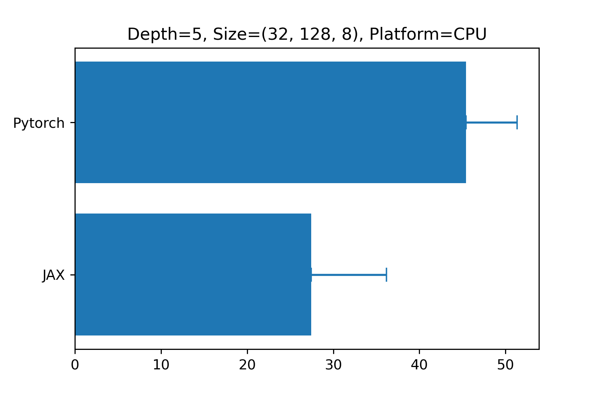
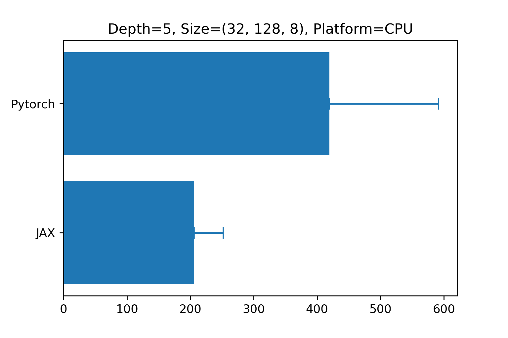

# Signax: Computing signatures in JAX

[](https://github.com/anh-tong/signax/actions/workflows/run-tests.yml)


## Goal

To have a library that supports signature computation in JAX. See [this paper](https://arxiv.org/abs/1905.08494) to see how to adopt signatures in machine learning.

This implementation is inspired by [patrick-kidger/signatory](https://github.com/patrick-kidger/signatory).


## Examples

Basic usage

```python
import jax
import jax.random as jrandom

from signax.signature import signature

key = jrandom.PRNGKey(0)
depth = 3

# compute signature for a single path
length = 100
dim = 20
path = jrandom.normal(shape=(length, dim), key=key)
output = signature(path, depth)
# output is a list of array representing tensor algebra

# compute signature for batches (multiple) of paths
# this is done via `jax.vmap`
batch_size = 20
path = jrandom.normal(shape=(batch_size, length, dim), key=key)
output = jax.vmap(lambda x: signature(x, depth))(path)
```

Integrate with [equinox](https://github.com/patrick-kidger/equinox) library

```python
import equinox as eqx
import jax.random as jrandom

from signax.module import SignatureTransform

# random generator key
key = jrandom.PRNGKey(0)
mlp_key, data_key = jrandom.split(key)

depth=3
length, dim = 100, 3

# we signature transfrom
signature_layer = SignatureTransform(depth=depth)
# finally, getting output via a neural network 
last_layer = eqx.nn.MLP(depth=1, 
                        in_size=3 + 3**2 + 3**3,
                        width_size=4, 
                        out_size=1,
                        key=mlp_key)

model = eqx.nn.Sequential(layers=[signature_layer, last_layer])
x = jrandom.normal(shape=(length, dim), key=data_key)
output = model(x)
```

Also, check notebooks in `examples` folder for some experiments of [deep signature transforms paper](https://arxiv.org/abs/1905.08494).
## Installation

Via pip
```
pip install signax
```

Via source
```
git clone https://github.com/anh-tong/signax.git
cd signax
python setup.py install .
```


## Parallelism 

This implementation makes use of `jax.vmap` to perform the parallelism over batch dimension. 

Paralelism over chunks of paths is done using `jax.vmap` as well. 

A quick comparison can be found at in the notebook `examples/compare.ipynb`. Below plots are comparison of forward and backward pass in both GPU and CPU for path `size=(32, 128, 8)` and signature `depth=5`

<table>
<thead>
  <tr>
    <th >Forward</th>
    <th > Backward</th>
  </tr>
</thead>
<tbody>
  <tr>
    <td>
        
    </td>
    <td>
        
    </td>
  </tr>
  <tr>
    <td>
        
    </td>
    <td>
        
    </td>
  </tr>
</tbody>
</table>

## Why is using pure JAX good enough?

Because JAX make use of just-in-time (JIT) compilations with XLA, Signax can be reasonably fast. 

We observe that the performance of this implementation is similar to Signatory in CPU and slightly better in GPU. It could be because of the optimized operators of XLA in JAX. Note that [Signatory](https://github.com/patrick-kidger/signatory) contains highly optimized C++ source code (PyTorch with Pybind11).

## Acknowledgement

This repo is based on
- [Signatory](https://github.com/patrick-kidger/signatory)
- [Deep-Signature-Transforms](https://github.com/patrick-kidger/Deep-Signature-Transforms)
- [Equinox](https://github.com/patrick-kidger/equinox)
